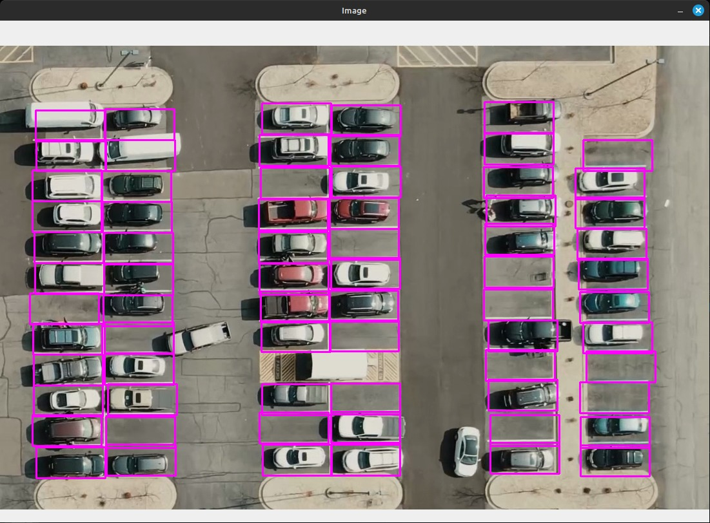

# Smart Car-App: Car Parking Reservation Facility and Service provider Locator
✨🚘🚔 A prototype of a parking reservation app that implements smart booking of parking slots and other features like identifying car service stations and charging dock locators for electric cars ✨🚘🚔

# Contents
1. [Car Parking Reservation System 🚗🅿](#Car-Parking-Reseravtion-System)
   
	(a) Parking Space identifier

	(b) Reservation portal layout

	(c) Tools utilised and Performance metric

2. Service station and Electric Dock Chargers Locator⚙️⚡
        (a) Website Layout
   
	(b) Map services used

# Car-Parking-Reservation-System 🚗🅿
## Parking Space identifier:
From a parking space layout, the spaces available for parking are selected. The code is divided into two segments: **Parking space picker** and **Parking space counter**.
### Parking Space picker:  

+ The pickle library converts Python objects to a byte stream for storage and deserialization. 

+ Initially a rectangle of dimension 107 x 48 pixels is defined to pick the parking space from the given camera footage. [The selected dimensions are for the considered footage] 

+ Based on the type of footage available from different locations, appropriate dimensions can be set. 

+ The image of the layout is loaded into the code. The rectangle declared previously is utilised to select the parking space in the layout by simply clicking (Left Mouse Button) the spaces. 

+ If a parking space is incorrectly selected, the rectangle can be deselected by clicking it by Right Mouse Button.     

+ The selected parking spaces are loaded into a list as coordinates into a “.txt” file named “CarParkPos.txt” in binary reading mode. From the pickle library, the function pickle.load() deserializes the data into a Python list.
  
+ The program keeps running in a loop. This loop continuously displays the car park image (carParkImg.png) and handles mouse interactions on the image window to continuously list and store the spaces.

The image depicts the output of the Parking space picker code. The rectangles are placed in the parking space by selecting them through Mouse clicks. 

## Parking Space counter:

+ The video processing is done from a pre-recorded footage of a parking space layout. OpenCV and CVZone libraries are used for image and video processing.  

+ From the image generated from the Parking Space picker code, this code identifies free parking spaces by measuring the intensities of the selected parking spaces. From all the spaces, the median of the intensities of the spaces is taken as the threshold to classify them into free and occupied.  

+ The code performs grayscale conversion, applies gaussian and median blur for noise reduction of the image and adaptive thresholding for foreground and background distinction. The program waits for 10 milli seconds before processing the next frame. 

+ Converting each frame to grayscale significantly reduces the amount of data processed, leading to faster processing speeds and potentially enabling real-time video analysis 

+ The Gaussian blur is a type of image-blurring filter that uses a Gaussian function for calculating the transformation to apply to each pixel in the image. 

+ The Median blur operation is similar to the other averaging methods. Here, the central element of the image is replaced by the median of all the pixels in the kernel area. This operation processes the edges while removing the noise.

[(https://github.com/ColdTrigger24/Ctrl-C-s-Ctrl-V-s/assets/159794729/26574e98-a11c-43ba-bc64-973c56c3f96a)](https://github.com/ColdTrigger24/Ctrl-C-s-Ctrl-V-s/assets/159794729/8dfe94f6-a486-44bd-be9d-92c8c64d8b79
)

+ The parking spaces are classified into free and occupied and are denoted by green and red rectangles respectively. The intensities of each space in displayed in the bottom left of each rectangle. For the selected video, the threshold intensity is around 900.  

+ The code is set to provide an output indicating the number of free parking spaces in a layout. It updates the count of the free parking spaces instantaneously.  

+ Since the given code is for the prototype, for the original model will perform video processing based on live footages of parking spaces in real-time. From that live video processing, the output will be sent to a layout designed for reservation. The layout indicates the user about the cars that are present in the parking space by updating the layout using the output of the car parking counter code.

# Reservation portal layout:
The vital component in a smart parking app is displaying the parking layout for the user for better user interface and efficient working of the app. The new feature will seamlessly display a dynamic parking layout alongside real-time availability data. Users can easily view available parking spaces directly on the layout, eliminating guesswork and wasted time.
The parking layout integrated in our project has been further divided into three: 

+ HTML Structure: 

  HTML (HyperText Markup Language) is the code that is used to structure a web page and its content. 

+ CSS Styling: 

  CSS stands for Cascading Style Sheets and it is used for designing and responsiveness of web pages. It helps in maintaining the positioning of each element that should be displayed on the web page. It is highly used for creating interactive user interfaces.’ 

 

+ JavaScript: 

  To provide an interface between a website and its users and to enable developers to write code that can respond to user events, such as clicking a button or entering data into a form. 

 

Now let's see how these IDEs are used in the execution of the parking layout. 
## HTML Structure: 

It comprises two main sections:  

+ Navbar  

+ Dashboard. 

**NAVBAR:** 

+ The navbar is contained within a 
 element with the class "navbar". 

+ Within the navbar, there is a 
 with the class "brand", which displays the brand name of the application, "PARKING MANAGER v 1.0".

**DASHBOARD:** 

+ The dashboard is contained within a 
 element with the class "dashboard". 

+ It consists of two main sections: "Parking Manager" and "Parking Space". 

+ Parking Manager Section: 

+ This section contains buttons for slot management and queue management. 

+ Users can interact with these buttons to perform respective actions. 

+ It also includes a container for displaying the parking slots and the queue. 

**Parking Space Section:** 

+ This section visually represents the parking slots and entry/exit lanes. 

+ It contains containers for parking slots, entry/exit lanes, and another set of parking slots. 

**Entry/Exit Lane:** 

+ A separate section represents the entry and exit lane, labeled as "Entry / Exit".

## CSS STYLING: 

**Global Styling:** 

+ This block sets the styling for the <html> and <body> elements. 

+ It ensures that the body takes up the entire viewport and uses the Roboto font family for text. 

+ The background is set to a dark color (rgb(24, 20, 20)) with properties to cover the entire background without repeating.
 
**Navbar Styling:** 

+ This section styles the navbar. 

+ It sets the width to 100% of its container, adds left padding, sets the height to 60px, and applies a dark background color with specific RGB values. 

+ The text color is set to a shade of blue (rgb(49, 185, 206)).

**BRAND STYLING:** 

+ This style is applied to the brand name within the navbar. 

+ It ensures the brand text is vertically centered within the navbar (line-height equal to the navbar height). 

+ Letter spacing is increased slightly for better readability.

**PARKING MANAGER STYLING:** 

+ This style is applied to the container for the parking manager section. 

+ It sets the background color to a slightly lighter shade of dark color. 

+ The container takes up 25% of the width of its parent container and is displayed as a column flexbox.

**BUTTON AND QUEUE STYLING:** 

+ These styles are applied to the buttons within the parking manager section and the individual parking slot buttons. 

+ Button backgrounds are set to specific RGB colors, with white text color for better contrast. 

+ Padding, font size, and text alignment properties are adjusted for visual consistency and usability. 

+ Individual parking slot buttons have specific styling including background color, width, height, padding, and cursor style. 

**PARKING SPACE STYLING:** 

+ These styles are applied to the container for the parking space section, parking slot containers, individual parking slots, and the entry/exit lane section. 

+ The parking container is styled to take up the full width and height of its parent container, using flexbox for layout. 

+ Parking slots are displayed as flex containers with centered content (cars). 

+ Entry/exit lanes are styled with specific width, height, border properties, and background color.

**MISCELLANEOUS STYLING:** 

+ Additional styling includes positioning and transformation properties for the car animations (new-car-origin). 

+ Styling for queue items (queue img) includes background color, padding, border, and text alignment. 

+ Styling for the "Add to Queue" button (addtoqueue) includes background color, text color, padding, font size, margin, text alignment, cursor style, and border properties.

## JAVA FUNCTIONALITY: 

**INITIALIZATION FUNCTION:** 

+ This function initializes the parking manager system. 

+ It calculates the width (w) and height (h) of the parking space container. 

+ It dynamically creates animation keyframes using CSS @keyframes rule to simulate car movements during entry and exit. 

+ The animation keyframes define different stages of car movement, including rotation and translation, and are added to the document dynamically.

**UPDATE QUERY FUNCTION:** 

+ This function updates the queue visually by changing the source of the queue item images. 

+ It iterates through the queue items and updates the image source based on the number of items in the queue (queueitems). 

**ADD TO QUEUE FUNCTION:** 

+ This function adds a car to the queue if there are no free parking slots available. 

+ It checks if there are any free parking slots by iterating through the parklist array. 

+ If there are free parking slots, it increments the queueitems count and updates the queue visually using the updatequeue() function.

**QUEUE CHECK FUNCTION:** 

+ This function checks if there are cars in the queue. 

+ If there are cars in the queue, it decrements the queueitems count, updates the queue visually, and parks the car in the specified slot using the carenter() function. 

**CAR EXIT FUNCTION:** 

+ This function handles the exit of a car from a parking slot. 

+ It marks the specified parking slot as empty in the parklist array. 

+ It animates the exit of the car from the parking slot by changing the background color and removing the car element from the DOM after a delay. 

+ After the animation completes, it checks the queue for cars waiting to enter using the queuecheck() function.

**GENERATE NEW CAR FUNCTION:** 

+ This function generates a new car element and appends it to the parking space container. 

+ It creates a new  element, sets its source to a car image, and assigns it a unique ID based on the specified slot. 

+ The car element is positioned using CSS for animation purposes.

**CAR ENTER FUNCTION:** 

+ This function handles the entry of a car into a parking slot. 

+ It checks if the specified parking slot is empty and if the parking manager is not locked (indicating no ongoing animations). 

+ If the parking slot is empty and the parking manager is not locked, it marks the parking slot as occupied in the parklist array, generates a new car element using the generatenewcar() function, and updates the background color of the parking slot. 

+ After a delay, it unlocks the parking. 

https://github.com/ColdTrigger24/Ctrl-C-s-Ctrl-V-s/assets/159794729/5343b118-fb8a-4226-8219-2da1583f3242

## Website Layout:
**Web – App:** 

+ The Webapp is created using primarily php, html, javascript, css 

+ PHP allows web developers to create dynamic content and interact with databases. PHP is known for its simplicity, speed, and flexibility — features that have made it a cornerstone in the web development world. 

+ HTML, CSS, JS are the basic building blocks of the website where, 

+ HTML – provides structure 

+ CSS – style  

+ JS - Functionality 

+ The Webapp is connected to a mysql database and is hosted using apache and lets the user store their data for convenience which proves the need for login/register, which is implemented to store essential information of the user which can be accessed later with the right credentials. 

+ The Webapp also gives the user the flexibility to update their information. The upcoming section contains method of implementation of each feature.

**Login/Register system:** 

+ To enable the user to login/register, two forms have been created and styled using HTML and CSS 

+ The form has their method set to POST, this enables the user info to be invisible on the interface by not storing the data on the site 

+ Login has 2 required fields: Username, Password 

+ Register has 4 required fields: Username, Password, Email, phone no. 

+ Where all this info. With additional information such as reg date/time has been stored in database to maintain user’s activity if required 

+ Where each username is hard limited to be unique, and all the password’s are hashed and stored to prevent ease of data leak if the database is compromised due to malicious code such as sql injection. 

+ When login is requested, the given username and password is checked if a mismatch occurs or it is not found, the appropriate message is displayed in a popup dialog box. 

+ When register is requested the username is checked whether is it already taken and the data is stored when username is not already taken, appropriate action is taken according to the case, 

+ Here for convenience username is set to be of a Indian vehicle registration plate format as it is unique and fits the needs.

+ If login is successful the web-app proceeds to home page where the user info can is displayed and all the features o such as updating the user info, Parking reservation, Charging dock locator, etc.. are displayed along with the option to log out. 

+ The update option lets the user update their info appropriately, the method used is similar to that of registration, here the along with all the process of registration, old password is also checked for further protection. 

+ The log out option closes all connections and clears the buffer storing the user info and it redirects back to the login page. 

+ All the other options are used for navigation.

